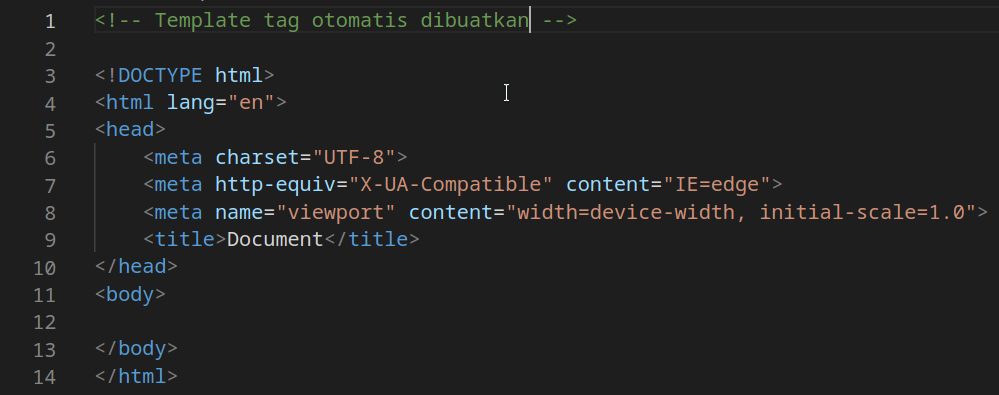

# Dasar HTML

## Dokumen HTML

- Dokumen **HTML** harus diawali dengan deklarasi tipe dokumen `<!DOCTYPE html>`.
- Dokumen **HTML** harus memiliki tag `html`, dimulai dengan tag pembuka `<html>` dan diakhiri dengan tag penutup `</html>`.
- Dokumen **HTML** harus memiliki tag `head`, dimulai dengan tag pembuka `<head>` dan diakhiri dengan tag penutup `</head>`.
- Dokumen **HTML** harus memiliki tag `body`, dimulai dengan tag pembuka `<body>` dan diakhiri dengan tag penutup `</body>`.
- Elemen **HTML** harus diletakkan di dalam tag `body`.

    Contoh dokumen HTML:

    ```html
    <!DOCTYPE html>
    <html lang="en">
        <head>
        <meta charset="UTF-8" />
        <meta http-equiv="X-UA-Compatible" content="IE=edge" />
        <meta name="viewport" content="width=device-width, initial-scale=1.0" />
        <title>Hello World</title>
        </head>
        <body>
        <!--Masukkan elemen HTML di dalam tag body -->
        <h1>Hello World</h1>
        <p>Halo Dunia</p>
        </body>
    </html>
    ```

#### Hasil


## Emmet Abbreviation

Pada beberapa IDE seperti Visual Studio Code, tersedia fitur Emmet yang berguna untuk mempermudah pembuatan dokumen HTML di atas, yaitu dengan mengetik tanda `!` lalu tekan `Enter`.


