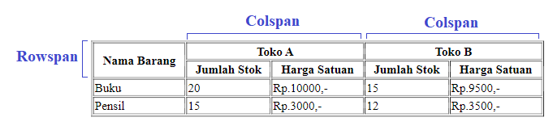

# Tabel HTML

## Apa Itu Tabel HTML?

Tabel HTML adalah elemen untuk menyajikan data dalam bentuk tabel.

Tag `<table>` mendefinisikan tabel HTML.

- Setiap **baris** tabel didefinisikan dengan tag `<tr>`.
- Setiap **header** tabel didefinisikan dengan tag `<th>`. Secara bawaan, teks dalam elemen `<th>` dicetak tebal dan rata tengah.
- Setiap **data/sel** tabel didefinisikan dengan tag `<td>`. Secara bawaan, teks dalam elemen `<td>` normal dan rata kiri.

Contoh:

```html
<table style="width:100%">
  <tr>
    <th>Nama Barang</th>
  <th>Jumlah Stok</th>
    <th>Harga satuan</th>
  </tr>
  <tr>
    <td>Buku</td>
    <td>20</td>
  <td>Rp10.000,-</td>
  </tr>
  <tr>
    <td>Pensil</td>
    <td>15</td>
  <td>Rp3.000,-</td>
  </tr>
</table>
```

### Colspan dan Rowspan

*Colspan* dan *Rowspan* adalah atribut pada HTML Table yang digunakan untuk melebarkan sebuah kolom secara vertikal atau horizontal. *Colspan* dan *Rowspan* biasanya diterapkan pada tabel yang kompleks dan multi-dimensi. Atribut `colspan` dan `rowspan` dapat digunakan pada tag `th` dan `td`. 

Contoh penerapan *Colspan* dan *Rowspan* dapat dilihat pada gambar berikut.



Berikut penjelasan tentang atribut *Colspan* dan *Rowspan*.

- `colspan` digunakan untuk merentangkan kolom secara horizontal atau terhadap kolom selanjutnya.
- `rowspan` digunakan untuk merentangkan kolom secara vertikal atau terhadap baris selanjutnya.

Contoh:

```html
<table style="width:100%" border="1">
  <tr>
    <th rowspan="2">Nama Barang</th>
    <th colspan="2">Toko A</th>
    <th colspan="2">Toko B</th>
  </tr>
  <tr>
    <th>Jumlah Stok</th>
  <th>Harga Satuan</th>
    <th>Jumlah Stok</th>
    <th>Harga Satuan</th>
  </tr>
  <tr>
    <td>Buku</td>
    <td>20</td>
  <td>Rp10.000,-</td>
    <td>15</td>
  <td>Rp9.500,-</td>
  </tr>
  <tr>
    <td>Pensil</td>
    <td>15</td>
  <td>Rp3.000,-</td>
    <td>12</td>
  <td>Rp3.500,-</td>
  </tr>
</table>
```
