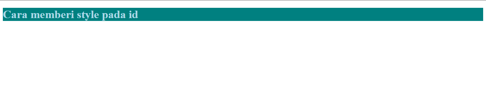
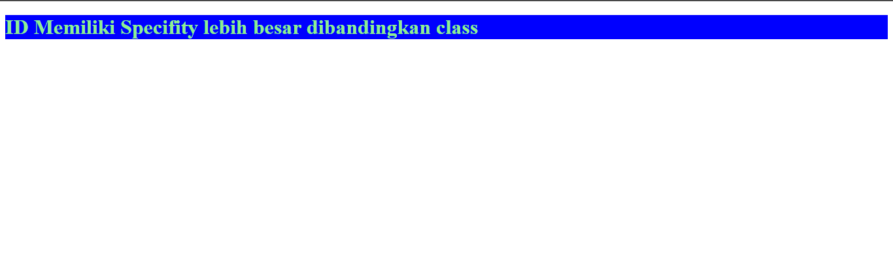

# ID HTML

ID adalah atribut pada HTML yang digunakan untuk memberikan tanda pada elemen HTML yang bersifat unik.
Artinya, Anda tidak boleh memiliki elemen dengan ID yang sama dalam satu dokumen HTML. Cara mengakses
ID di dalam CSS adalah dengan tanda pagar (#), misalnya seperti di bawah ini:

```html
<!DOCTYPE html>
<html lang="en">
  <head>
    <title>HTML ID</title>
    <style>
      #coba-id {
        color: lightblue;
        background-color: teal;
      }
    </style>
  </head>
  <body>
  <h1 id="coba-id">Memberi style pada id</h1>
  </body>
</html>
```

Hasilnya:


## Perbedaan id dan class

- Elemen HTML boleh memiliki class yang sama, sementara id tidak.
- ID memiliki "specificity" yang lebih besar dibanding class. Lihat contoh di bawah agar lebih jelas.

```html
<!DOCTYPE html>
<html lang="en">
  <head>
  <title>Contoh Specificity pada ID</title>
    <style>
      #ini-id {
        color: lightgreen;
        background-color: blue;
      }

      .ini-class {
        background-color: red;
        color: orange;
      }
    </style>
  </head>
  <body>
  <h1 id="ini-id" class="ini-class">ID memiliki specificity lebih besar dibanding class</h1>

    <!-- h1 di atas akan memiliki warna lightgreen dengan background blue, sesuai dengan style yang diberikan pada ID. -->
  <!-- Hal ini disebabkan karena ID memiliki specificity lebih besar dibanding class. -->
  </body>
</html>
```

Hasilnya:


> Catatan:
>
> - Penulisan id peka huruf besar-kecil (case-sensitive); `id="test-id"` berbeda dengan `id="TEST-ID"`.
> - Penulisan id harus memiliki setidaknya satu karakter.
> - Penulisan id tidak boleh diawali dengan angka.
> - Penulisan id tidak boleh mengandung spasi, tab, dan sejenisnya.

Referensi:

- [W3School](https://www.w3schools.com/html/html_id.asp)
- [MDN](https://developer.mozilla.org/en-US/docs/Web/HTML/Global_attributes/id)
