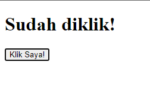

# Skrip HTML (HTML Script)

Dalam HTML, tag `<script>` digunakan untuk menyisipkan skrip (script), biasanya menggunakan JavaScript. Mengapa kita membutuhkan skrip? Agar situs web menjadi interaktif.
Anda dapat menuliskan skrip langsung di dalam HTML atau memisahkannya ke berkas lain, lalu tambahkan atribut `src=""` untuk menautkan skrip tersebut.

Memanipulasi situs web dengan JavaScript disebut manipulasi DOM (DOM Manipulation). Anda dapat mempelajarinya di repositori Bellshade [JavaScript](https://github.com/bellshade/Javascript/tree/main/learn/DOM).

## Contoh Penggunaan `<script>`

```html
<html lang="en">
  <head>
    <title>Script</title>
  </head>
  <body>
    <h1 id="h1">Belum diklik!</h1>
    <button id="button">Klik Saya!</button>

    <script>
      document.getElementById("button").addEventListener("click", function () {
        document.getElementById("h1").innerText = "Sudah diklik!";
      });
    </script>
  </body>
</html>
```

Hasilnya:

- 
- 

## Atribut pada `<script>`

| Attribute        | value                                                                                                                                                              | Deskripsi                                                                                                                                                                                                                                                                  |
| ---------------- | ------------------------------------------------------------------------------------------------------------------------------------------------------------------ | -------------------------------------------------------------------------------------------------------------------------------------------------------------------------------------------------------------------------------------------------------------------------- |
| `async`          | async                                                                                                                                                              | Mengunduh skrip saat HTML sedang diurai (parse), lalu mengeksekusinya segera setelah selesai diunduh, tanpa menunggu posisi tag `<script>`. (Atribut ini hanya untuk skrip eksternal)                                                                                     |
| `crossorigin`    | `anonymous`, `use-credential`                                                                                                                                      | Membuat mode request menjadi HTTP CORS Request.                                                                                                                                                                                                                             |
| `defer`          | defer                                                                                                                                                              | Mengunduh skrip saat HTML sedang diurai. Setelah selesai diunduh, skrip dieksekusi ketika HTML telah selesai diurai. (Atribut ini hanya untuk skrip eksternal)                                                                                                             |
| `integrity`      | _hash file_                                                                                                                                                        | Memungkinkan peramban memeriksa skrip yang diambil dan memastikan tidak dijalankan apabila sumber dimanipulasi.                                                                                                                                                           |
| `nomodule`       | `true`, `false`                                                                                                                                                    | Menentukan bahwa skrip tidak boleh dijalankan di peramban yang mendukung modul ES2015.                                                                                                                                                                                    |
| `referrerpolicy` | `no-referrer`, `no-referrer-when-downgrade`, `origin`, `origin-when-cross-origin`, `same-origin`, `strict-origin`, `strict-origin-when-cross-origin`, `unsafe-url` | Menentukan informasi rujukan (referrer) yang dikirim saat mengambil skrip.                                                                                                                                                                                                |
| `src`            | _URL_                                                                                                                                                              | Menentukan URL berkas skrip yang akan digunakan.                                                                                                                                                                                                                           |
| `type`           | `module`, `text/javascript`, dsb.                                                                                                                                  | Menentukan jenis skrip.                                                                                                                                                                                                                                                    |

Referensi:

- [W3School](https://www.w3schools.com/html/html_scripts.asp)
