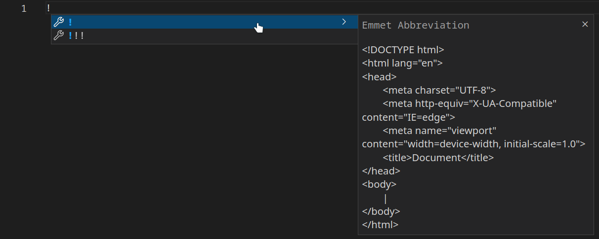

# Head HTML

`<head>` merupakan salah satu elemen utama dalam HTML. Elemen `<head>` digunakan sebagai wadah untuk metadata.
Apa itu metadata? Pada HTML, metadata adalah data yang berisi informasi tentang dokumen HTML dan tidak ditampilkan ketika kode dijalankan. Metadata biasanya digunakan untuk menentukan judul dokumen, style, script, dan informasi meta lainnya. Elemen yang biasa dimasukkan pada tag `<head>` adalah `<title>`, `<style>`, `<meta>`, `<link>`, `<script>`, dan `<base>`.

## Emmet Abbreviation

Pada beberapa IDE seperti Visual Studio Code, tersedia Emmet yang berguna untuk mempermudah pembuatan template HTML, yaitu dengan mengetik tanda `!` lalu menekan `Enter`.




## `<title>`

`<title>` digunakan untuk memberikan judul pada halaman situs web. `<title>` hanya boleh berisi teks dan akan ditampilkan pada bilah tab di peramban. Elemen ini wajib ada pada dokumen HTML dan sangat penting untuk Search Engine Optimization (SEO) karena ditampilkan pada hasil mesin pencari.

## `<style>`

`<style>` digunakan untuk memberi gaya pada halaman situs web. Materi ini sudah dibahas [di sini](https://github.com/bellshade/HTML-CSS/tree/main/HTML/008%20HTML%20Style), silakan cek materi tersebut untuk penjelasan lebih jelas.

## `<link>`

`<link>` digunakan untuk menghubungkan HTML dengan sumber daya eksternal yang dibutuhkan. Elemen ini paling sering digunakan untuk menghubungkan HTML dengan CSS eksternal, namun bisa juga untuk menambahkan favicon pada halaman situs web. Favicon adalah gambar kecil yang ditampilkan di sebelah judul pada tab peramban. Untuk menambahkannya, Anda bisa menggunakan tag `<link>` seperti ini:

```html
<!DOCTYPE html>
<html lang="id">
  <head>
    <title>Bellshade</title>
    <link rel="shortcut icon" href="bellshade.png" type="image/x-icon" />
  </head>
  <body></body>
</html>
```

Hasilnya:


## `<meta>`

`<meta>` digunakan untuk menentukan karakter set, deskripsi halaman, pembuat halaman, dan lainnya. Selengkapnya, lihat [materi ini](https://github.com/bellshade/HTML-CSS/tree/main/HTML/026%20HTML%20Meta) untuk penjelasan lebih detail tentang `<meta>`.

## `<script>`

`<script>` digunakan untuk menyisipkan skrip (script), biasanya menggunakan JavaScript. Lihat [materi ini](https://github.com/bellshade/HTML-CSS/tree/main/HTML/023%20HTML%20Script) karena sudah dibahas sebelumnya.

## `<base>`

`<base>` digunakan untuk menentukan URL dasar sebuah dokumen, sebagai acuan untuk semua URL relatif. Anda hanya boleh menggunakan satu elemen `<base>`. Di dalam elemen `<base>` Anda bisa menggunakan `href`, `target`, atau keduanya. Jika menambahkan atribut `target` pada elemen ini, maka bawaan semua [tautan](https://github.com/bellshade/HTML-CSS/tree/main/HTML/014%20HTML%20HyperLink) akan memiliki atribut yang diberikan pada elemen `<base>`.
