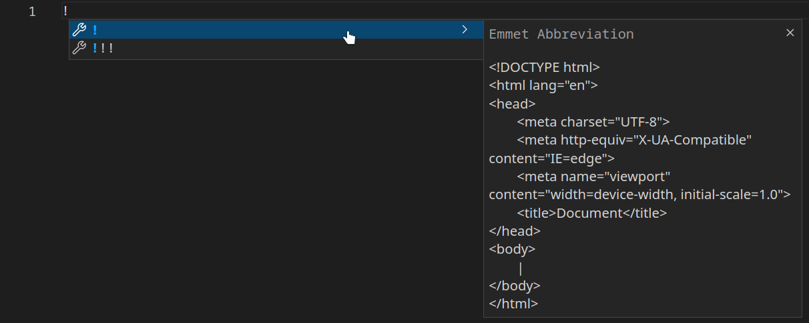

# Tag `<meta>` di HTML

### Apa Itu Tag `<meta>`?

Tag `<meta>` di dalam HTML mendefinisikan metadata tentang dokumen HTML. Metadata adalah informasi tentang data.

Tag `<meta>` selalu berada di dalam elemen `<head>` dan biasanya digunakan untuk menentukan karakter set, mendeskripsikan halaman, penulis dokumen, dan pengaturan viewport.

Metadata tidak terlihat di halaman situs web namun dapat dilihat di source code.

Metadata digunakan oleh peramban (cara menampilkan konten atau memuat ulang halaman web), mesin pencari (kata kunci), dan layanan web lainnya.

Melalui tag `<meta>`, desainer web dapat mengendalikan viewport (area halaman web yang terlihat pengguna).

### Emmet Abbreviation

Pada beberapa IDE seperti Visual Studio Code, tersedia Emmet yang mempermudah pembuatan template HTML, termasuk `<meta>`, dengan mengetik `!` lalu menekan `Enter`.




#### Contoh kode

```html
<head>
  <meta charset="UTF-8" />
  <meta name="description" content="Cara PR" />
  <meta name="keywords" content="Github, PR, Pull request" />
  <meta name="author" content="Putri Aliya" />
  <meta name="viewport" content="width=device-width, initial-scale=1.0" />
</head>
```

#### Contoh lain

Kata kunci untuk mesin pencari:
`<meta name="keywords" content="Github, PR, Pull request">`

Deskripsi untuk halaman:
`<meta name="description" content="Cara PR">`

Penulis situs:
`<meta name="author" content="Putri Aliya">`

Memuat ulang dokumen setiap 40 detik:
`<meta http-equiv="refresh" content="40">`

Pengaturan viewport agar situs terlihat bagus di semua perangkat:
`<meta name="viewport" content="width=device-width, initial-scale=1.0">`

### Pengaturan viewport

Area pandang (viewport) adalah area halaman web yang terlihat oleh pengguna. Ukurannya bervariasi tergantung perangkat; viewport pada ponsel lebih kecil daripada pada komputer.

Elemen `<meta>` ini sebaiknya disertakan di semua halaman web:
`<meta name="viewport" content="width=device-width, initial-scale=1.0">`
Ini memberi peramban instruksi untuk mengontrol dimensi dan skala halaman web.

`width=device-width` mengatur lebar halaman untuk mengikuti lebar layar perangkat (yang akan bervariasi tergantung pada perangkat).

`initial-scale=1.0` mengatur tingkatan zoom pertama saat halaman web pertama kali dimuat.

Referensi: https://www.w3schools.com/tags/tag_meta.asp

### Open Graph

Open Graph merupakan protokol untuk integrasi situs web ke media sosial, seperti Facebook, Twitter, LinkedIn, dan lain-lain. Dengan Open Graph, kita dapat mengontrol informasi yang ditampilkan saat membagikan tautan situs web.

Protokol ini pertama kali diperkenalkan oleh Facebook pada tahun 2010.

Cara menambahkan Open Graph pada situs web:

```html
<meta property="og:url" content="https://www.linkwebsite.com" />
<!-- Tag ini merepresentasikan link halaman yang akan ditampilkan -->
<meta property="og:title" content="Pengenalan Mengenai Open Graph" />
<!-- Tag ini merepresentasikan judul yang akan ditampilkan -->
<meta
  property="og:description"
  content="`Open Graph` merupakan protocol dalam integrasi website kedalam sosial media, seperti Facebook, Twitter, LinkedIn, dll.
Dengan  `Open Graph` kita dapat mengontrol informasi apa saja yang dapat ditampilkan pada sosial media ketika kita membagikan link website kita."
/>
<!-- Tag ini merepresentasikan deskripsi website yang akan ditampilkan -->
<meta property="og:image" content="https://www.linkwebsite/link-gambar" />
<!-- Tag ini merepresentasikan gambar yang akan ditampilkan -->
```

Open Graph bermanfaat untuk SEO; dengan menambahkan informasi yang jelas, mesin pencari lebih mudah menampilkan situs kita di hasil pencarian.

Lalu bagaimana cara kita mengecek apakah Open Graph sudah benar-benar terintegrasi dengan website kita?

Beberapa media sosial memiliki debugger masing-masing, contohnya:

Facebook: https://developers.facebook.com/tools/debug/

Twitter: https://cards-dev.twitter.com/validator

LinkedIn: https://www.linkedin.com/post-inspector/

Pinterest: https://developers.pinterest.com/tools/url-debugger/

Atau gunakan alat di https://www.opengraph.xyz/

Referensi: https://ogp.me/.
