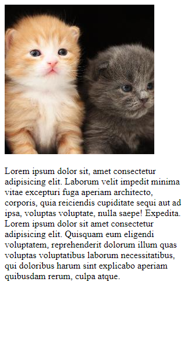
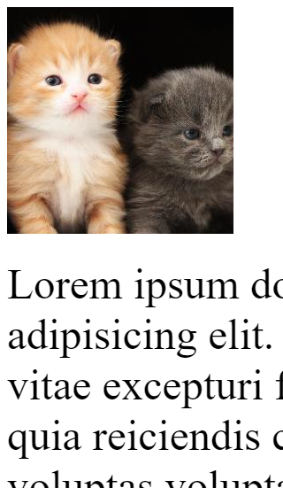

# HTML Responsif

## Apa Itu HTML Responsif?

HTML responsif berfungsi agar situs web terlihat baik di semua perangkat, seperti PC/laptop, tablet, dan ponsel.

## Viewport

Agar situs web terlihat baik di semua perangkat, tambahkan pengaturan viewport terlebih dahulu.

Caranya, gunakan tag `<meta>` di dalam `<head>`:

```html
<meta>
```

Setelah itu, tambahkan beberapa atribut di dalam tag `<meta>`, yaitu `name` dan `content`.

```html
name="viewport" content="width=device-width, initial-scale=1.0"
```

Setelah menambahkan tag `<meta>` beserta atributnya, di dalam tag `<head>` Anda akan memiliki:

```html
<meta name="viewport" content="width=device-width, initial-scale=1.0">
```

## Emmet Abbreviation

Pada beberapa IDE seperti Visual Studio Code, tersedia Emmet untuk mempermudah pembuatan tag-tag di atas. Ketik `!` lalu tekan `Enter`.


## Contoh sebelum dan sesudah menambahkan viewport

### Sebelum



### Sesudah


