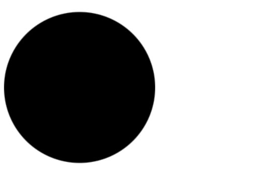

# SVG HTML

## Apa itu SVG HTML?

Scalable Vector Graphics (SVG) adalah format gambar vektor, baik berupa garis, goresan (stroke), diagram, peta, maupun ilustrasi lainnya.

Penulisannya menggunakan XML (Extensible Markup Language) sebagai dasar untuk membentuk gambar vektor dua dimensi.

## Mengapa menggunakan SVG?

Beberapa alasan menggunakan SVG, di antaranya:

- Ketika diperbesar, gambar SVG tidak pecah.
- Dapat dibuat dan dimodifikasi dengan penyunting teks.
- Dapat dianimasikan.
- Berkas SVG biasanya lebih kecil dan bersifat scalable.
- Lebih mudah dikompresi dibandingkan format lain.

## Bagaimana cara menggunakan SVG?

1. Menggunakan SVG pada tag ``

   Cara termudah menerapkan gambar SVG pada web adalah menyisipkannya pada elemen `` dan menambahkan deskripsi dengan atribut `alt`, seperti berikut:

   ```html
   
   ```

   

   Jika ukurannya terlalu besar, atur lebarnya, misalnya:

   ```html
   
   ```

   

2. Menggunakan SVG secara inline di HTML

   Tulis langsung di dokumen HTML dengan tag `<svg>`.

   ```html
   <body>
     <svg
       fill="none"
       height="2500"
       width="2183"
       xmlns="http://www.w3.org/2000/svg"
       viewBox="0 0 124 141.53199999999998"
     >
       <path
         d="M10.383 126.894L0 0l124 .255-10.979 126.639-50.553 14.638z"
         fill="#e34f26"
       />
       <path
         d="M62.468 129.277V12.085l51.064.17-9.106 104.851z"
         fill="#ef652a"
       />
       <path
         d="M99.49 41.362l1.446-15.49H22.383l4.34 47.49h54.213L78.81 93.617l-17.362 4.68-17.617-5.106-.936-12.085H27.319l2.128 24.681 32 8.936 32.255-8.936 4.34-48.17H41.107L39.49 41.362z"
         fill="#fff"
       />
     </svg>
   </body>
   ```

3. Menggunakan SVG pada tag `<iframe>`

```html
<iframe src="html-icon.svg" width="800" height="1200"></iframe>
```

> Tidak disarankan menggunakan tag `<iframe>` karena sulit dipelihara dan berdampak buruk bagi SEO.

4. Menggunakan SVG pada CSS

Hampir mirip dengan ``, hanya saja diterapkan pada CSS.

```css
body {
  background-image: url(html-icon.svg);
}
```

## Elemen SVG

SVG memiliki banyak elemen, di antaranya:

- `<circle>`

```html
<svg viewBox="0 0 100 100" xmlns="http://www.w3.org/2000/svg">
  <circle cx="50" cy="50" r="50" />
</svg>
```



- `<ellipse>`

```html
<svg viewBox="0 0 200 100" xmlns="http://www.w3.org/2000/svg">
  <ellipse cx="100" cy="50" rx="100" ry="50" />
</svg>
```


- `<line>`

```html
<svg viewBox="0 0 100 100" xmlns="http://www.w3.org/2000/svg">
  <line x1="0" y1="80" x2="100" y2="20" stroke="black" />
</svg>
```


- `<rect>`

```html
<svg viewBox="0 0 220 100" xmlns="http://www.w3.org/2000/svg">
  <rect width="100" height="100" />
</svg>
```


Untuk selengkapnya, kunjungi [MDN - SVG element reference](https://developer.mozilla.org/en-US/docs/Web/SVG/Element#svg_elements_a_to_z).

## Sumber

- [How to Use SVG Images in CSS and HTML – A Tutorial for Beginners](https://www.freecodecamp.org/news/use-svg-images-in-css-html/)
- [MDN - What is SVG?](https://developer.mozilla.org/en-US/docs/Learn/HTML/Multimedia_and_embedding/Adding_vector_graphics_to_the_Web#what_is_svg)
- [Medium - Membuat Peta Geografis HTML dengan SVG](https://medium.com/@dede.brahma2/membuat-peta-geografis-html-dengan-svg-c03e04987552)
- [Codepolitan - Membuat UI Website Modern dengan SVG](https://codepolitan.com/blog/membuat-ui-website-modern-dengan-svg-5b5980354860b)
