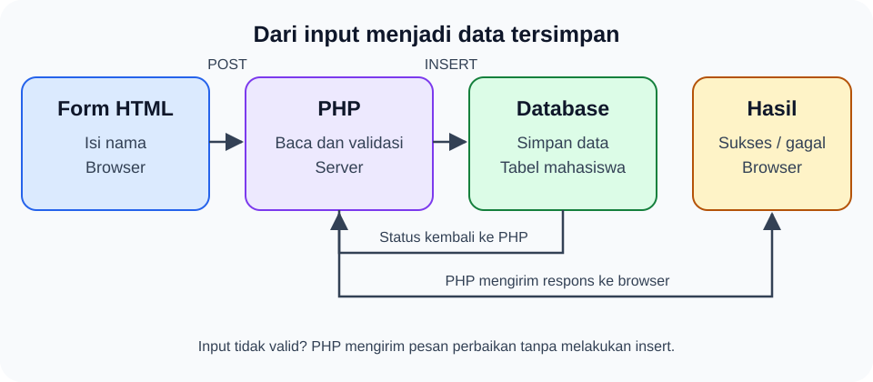

# Teori Koneksi Database

Pelajari perjalanan data dari form HTML, pemeriksaan oleh PHP, hingga penyimpanan ke database melalui contoh pendaftaran mahasiswa. Ikuti langkah-langkah berikut secara berurutan setelah memahami dasar HTML dan CSS.

## Tujuan pembelajaran

**Mahasiswa dapat menceritakan perjalanan data dari form sampai tersimpan.**

Setelah menyelesaikan modul ini, kamu dapat menjelaskan:

- Tugas form HTML, PHP, dan database.
- Empat informasi yang diperlukan untuk koneksi database.
- Langkah menyimpan data dan memberi pesan hasil.
- Mengapa input harus diperiksa terlebih dahulu.

Modul ini berfokus pada pemahaman alur. Contoh HTML dan PHP memperlihatkan pengiriman serta pemeriksaan isian; bagian koneksi dan penyimpanan menggunakan pseudocode untuk mengenalkan langkahnya. Implementasi lengkap dibahas pada materi praktik berikutnya.

## Langkah 1 — Kenali peran form, PHP, dan database

HTML menyusun halaman. CSS, Bootstrap, dan Tailwind membantu mengatur tampilannya. Setelah tombol Kirim ditekan, isian perlu diproses di server sebelum disimpan.



**Form HTML → PHP → Database → Hasil**

Bayangkan proses pendaftaran di bagian administrasi kampus:

| Bagian web | Analogi | Tugas |
| --- | --- | --- |
| Form HTML | Formulir pendaftaran | Mengumpulkan nama |
| PHP | Petugas administrasi | Menerima dan memeriksa isian |
| Database | Buku induk mahasiswa | Menyimpan data secara teratur |
| Hasil | Bukti pendaftaran | Memberi tahu berhasil atau gagal |

Browser adalah aplikasi untuk membuka web. Server adalah komputer yang menjalankan PHP dan melayani permintaan. Browser mengirim isian ke PHP; PHP yang berkomunikasi dengan database.

Jika nama belum diisi, PHP perlu menolak isian tersebut sebelum mencatatnya ke database.

### Apa itu database dan DBMS?

**Database (DB)** adalah kumpulan data yang disusun agar mudah dicari dan dikelola. Pada aplikasi kampus, database dapat berisi mahasiswa, mata kuliah, dan pendaftaran. Data tetap tersimpan setelah halaman browser ditutup, selama belum dihapus dari penyimpanannya.

**Database Management System (DBMS)** adalah perangkat lunak yang mengelola database: menerima perintah, menyimpan perubahan, mencari data, dan mengatur hak akses. MySQL dan MariaDB adalah contoh DBMS relasional. PostgreSQL merupakan contoh lain; SQLite menyimpan database dalam file dan tidak memerlukan layanan server terpisah.

Pada database relasional, data disusun dalam tabel yang dapat saling berhubungan. Contohnya, tabel pendaftaran dapat menyimpan `mahasiswa_id` untuk menunjuk mahasiswa yang mendaftar.

| Istilah | Arti | Contoh |
| --- | --- | --- |
| Database | Kumpulan tabel untuk suatu aplikasi | `kampus_latihan` |
| Tabel | Kumpulan catatan dengan struktur yang sama | `mahasiswa` |
| Kolom | Jenis informasi yang disimpan | `id`, `nama`, `email` |
| Baris / record | Satu catatan lengkap | Satu mahasiswa bernama Siti |
| Tipe data | Aturan jenis nilai pada kolom | `INT` untuk bilangan, `VARCHAR` untuk teks |
| Primary key | Penanda unik setiap baris | `id` mahasiswa |
| Foreign key | Kolom dengan aturan hubungan ke tabel lain | `mahasiswa_id` pada tabel pendaftaran |
| Query | Perintah yang dikirim ke DBMS | `SELECT nama FROM mahasiswa;` |

**SQL** adalah bahasa untuk memberi perintah kepada DBMS relasional. **CRUD** adalah empat kegiatan dasar pengelolaan data: create (menambah, biasanya `INSERT`), read (membaca, `SELECT`), update (mengubah, `UPDATE`), dan delete (menghapus, `DELETE`). `CREATE TABLE` digunakan untuk membuat struktur tabel, berbeda dengan menambahkan baris.

### Kenali alat untuk latihan lokal

**XAMPP** menyediakan paket lingkungan pengembangan lokal, termasuk Apache, PHP, MariaDB, dan phpMyAdmin. Komponen-komponen ini memiliki tugas yang berbeda:

| Komponen | Fungsi dalam latihan |
| --- | --- |
| XAMPP Control Panel | Menjalankan dan menghentikan layanan |
| Apache | Melayani permintaan web, misalnya halaman PHP melalui `localhost` |
| PHP | Menjalankan kode untuk menerima form dan mengakses database |
| MariaDB / MySQL | Menjalankan layanan database dan mengelola data |
| phpMyAdmin | Antarmuka web untuk membuat database/tabel dan menjalankan SQL |

XAMPP menyertakan MariaDB, meskipun tombol layanan di Control Panel tetap berlabel **MySQL**. Contoh PDO dengan driver `mysql` pada materi ini dapat digunakan untuk latihan MariaDB tersebut. Lihat [FAQ resmi XAMPP untuk Windows](https://www.apachefriends.org/faq_windows.html).

phpMyAdmin membantu mengelola database melalui browser. Database tetap dikelola oleh MariaDB/MySQL; menutup tab phpMyAdmin tidak menghentikan layanan database. Informasi alat tersedia di [situs resmi phpMyAdmin](https://www.phpmyadmin.net/).

XAMPP adalah salah satu pilihan. Kamu juga dapat memakai lingkungan lokal lain, seperti Laragon, atau memasang PHP dan MySQL/MariaDB secara terpisah. Ikuti satu lingkungan terlebih dahulu agar lokasi file dan port mudah dikenali.

## Langkah 2 — Siapkan form untuk mengirim data

Simpan contoh berikut sebagai `form.html`. Form ini mengirim nama mahasiswa ke file `proses.php` yang akan dibuat pada langkah berikutnya.

```html
<form action="proses.php" method="post">
  <label for="nama">Nama mahasiswa</label>
  <input id="nama" name="nama" type="text" required />
  <button type="submit">Kirim</button>
</form>
```

- **Field**: kotak isian untuk nama mahasiswa.
- `name="nama"`: label data yang akan dikenali oleh PHP.
- `action="proses.php"`: alamat tujuan pengiriman.
- `method="post"`: cara mengirim isian di badan permintaan.

`action` menentukan penerima isian, sedangkan `name` menentukan kunci data yang dibaca PHP. POST tidak otomatis membuat pengiriman terenkripsi; gunakan HTTPS.

## Langkah 3 — Terima dan periksa isian dengan PHP

PHP berjalan di server. Buat `proses.php` pada folder yang sama dengan `form.html`, lalu isi dengan contoh berikut:

```php
<?php
$input = $_POST['nama'] ?? '';
$nama = is_string($input) ? trim($input) : '';

if ($nama === '') {
    echo 'Nama wajib diisi.';
    exit;
}

echo 'Halo, ' . htmlspecialchars($nama, ENT_QUOTES, 'UTF-8');
```

`$_POST['nama']` mengambil isian nama. `trim()` membuang spasi di awal dan akhir. Jika nama kosong, PHP menghentikan proses dan meminta pengguna memperbaiki isian.

`echo` menampilkan pesan. `htmlspecialchars()` membuat input tampil sebagai teks ketika dimasukkan ke halaman HTML.

Untuk mencoba kedua file tersebut, gunakan server lokal yang mendukung PHP. Kirim nama melalui form dan perhatikan pesan yang muncul. Menampilkan “Halo, Siti” belum berarti nama Siti sudah tersimpan. Pemeriksaan di server tetap diperlukan meskipun form memiliki `required`.

## Langkah 4 — Pahami cara membuka koneksi database

### Siapkan lingkungan lokal dengan XAMPP

1. Unduh installer Windows dari [situs resmi Apache Friends](https://www.apachefriends.org/download.html), lalu pasang XAMPP. Contoh lokasi pemasangan pada modul ini adalah `C:\xampp`; sesuaikan jika lokasimu berbeda.
2. Buka **XAMPP Control Panel**, lalu klik **Start** pada Apache dan MySQL. Pastikan keduanya berstatus berjalan. Apache melayani halaman web; MySQL menjalankan database.
3. Buka `http://localhost/` untuk memeriksa Apache, lalu `http://localhost/phpmyadmin/` untuk membuka pengelola database. Alamat ini mengikuti port Apache bawaan; jika memakai port 8080, gunakan `http://localhost:8080/phpmyadmin/`.
4. Pada phpMyAdmin, buka tab **Databases**, isi nama `kampus_latihan`, pilih collation yang memakai `utf8mb4`, lalu klik **Create**. `utf8mb4` mendukung teks Unicode, termasuk emoji.
5. Pilih database tersebut, buka tab **SQL**, lalu jalankan contoh pembuatan tabel di bawah ini satu kali.

```sql
CREATE TABLE mahasiswa (
    id INT UNSIGNED AUTO_INCREMENT PRIMARY KEY,
    nama VARCHAR(100) NOT NULL
);
```

`AUTO_INCREMENT` menghasilkan nomor id secara otomatis. `NOT NULL` melarang nilai NULL; PHP tetap perlu menolak teks kosong. Pilih tabel `mahasiswa` dan tab **Structure** untuk melihat kolomnya. Tabel baru belum berisi baris.

Untuk mencoba `form.html` dan `proses.php` dari langkah sebelumnya melalui Apache, letakkan keduanya di `C:\xampp\htdocs\pendaftaran`, lalu buka `http://localhost/pendaftaran/form.html`. Membuka file dengan klik langsung atau alamat `file:///` tidak menjalankan PHP.

Contoh folder `contoh-koneksi-db` memakai cara berbeda: server bawaan PHP melayani folder `public` pada port 8000. Ikuti README contoh tersebut agar file konfigurasi koneksi tetap berada di luar folder publik.

### Kenali alamat, port, dan akun database

`localhost` menunjuk komputer sendiri. `127.0.0.1` adalah alamat loopback IPv4 untuk mengakses komputer sendiri melalui jaringan lokal proses. Gunakan host yang sesuai dengan izin akun database; akun untuk `localhost` dan `127.0.0.1` dapat diperlakukan berbeda oleh DBMS.

**Port** menentukan layanan tujuan pada suatu alamat. Apache biasanya memakai port 80 untuk HTTP; MySQL/MariaDB biasanya memakai 3306. Server latihan `php -S 127.0.0.1:8000` memakai 8000 untuk halaman web, sementara koneksi PHP ke database tetap menuju 3306. Periksa konfigurasi jika port telah diubah.

Gunakan akun administrator untuk menyiapkan database, tabel, dan akun latihan. Untuk aplikasi, buat akun `latihan_user` dengan password dan izin yang dibutuhkan, misalnya SELECT dan INSERT pada tabel `mahasiswa`. Login phpMyAdmin dan kredensial koneksi PHP perlu diperiksa masing-masing; halaman phpMyAdmin yang terbuka belum membuktikan akun aplikasi dapat terhubung.

### Hubungkan PHP ke database yang sudah disiapkan

Database menyimpan data dalam **tabel**. Bayangkan tabel seperti lembar daftar mahasiswa: kolom memberi nama informasi, baris berisi satu catatan mahasiswa.

| id | nama |
| --- | --- |
| 1 | Siti |
| 2 | Budi |

Sebelum menyimpan, PHP harus membuka koneksi dengan empat informasi:

| Informasi | Penjelasan sederhana | Analogi |
| --- | --- | --- |
| Host | Alamat server database, misalnya `localhost` | Alamat gedung |
| User | Akun yang diberi izin mengakses database | Nama petugas |
| Password | Rahasia untuk membuktikan akses akun | Kunci masuk |
| Nama database | Kumpulan tabel tujuan, misalnya `kampus` | Ruang arsip tujuan |

Selain empat informasi tersebut, cocokkan port dan charset koneksi. Pada contoh PDO berikutnya, koneksi memakai port `3306` dan charset `utf8mb4`.

**Pseudocode — gambaran langkah, bukan kode siap dijalankan:**

```text
ambil host, user, password, dan nama database dari konfigurasi server
buka koneksi menggunakan empat informasi tersebut
jika gagal: tampilkan "Penyimpanan belum tersedia" dan hentikan proses
jika berhasil: lanjutkan ke langkah penyimpanan
```

Siapkan database dan tabel sebelum menjalankan penyimpanan. Koneksi yang berhasil membuka akses ke database; data baru tersimpan setelah perintah insert berhasil dijalankan.

## Langkah 5 — Pahami cara menyimpan data dengan insert

**Insert** berarti menambahkan baris baru ke tabel. SQL adalah bahasa perintah untuk berkomunikasi dengan database.

Contoh bentuk perintah yang disiapkan PHP:

```sql
INSERT INTO mahasiswa (nama) VALUES (:nama);
```

Artinya: “Tambahkan satu mahasiswa, isi kolom nama dengan nilai yang dikirim.” `:nama` adalah tempat untuk nilai yang disertakan secara terpisah melalui **prepared statement**.

```text
periksa nama dari form
buka koneksi database
siapkan perintah insert
kirim nama sebagai parameter dan jalankan perintah
jika berhasil: tampilkan "Data berhasil disimpan"
jika gagal: tampilkan "Data belum tersimpan"
```

Jalankan penyimpanan setelah isian valid dan koneksi tersedia. Berikan pesan sukses setelah database mengonfirmasi bahwa data berhasil disimpan.

## Langkah 6 — Terapkan keamanan dasar

- **Periksa input di server.** Orang dapat mengirim isian tanpa memakai form kita. Cek nama tidak kosong dan panjangnya sesuai kolom tabel.
- **Pisahkan data dari SQL.** Gunakan prepared statement agar input diperlakukan sebagai nilai, bukan perintah tambahan.
- **Tampilkan input sebagai teks.** Gunakan `htmlspecialchars()` saat memasukkannya ke HTML.
- **Simpan password di konfigurasi server.** Gunakan variabel lingkungan atau file di luar folder publik; jangan menaruhnya di HTML, JavaScript, atau repositori.
- **Berikan pesan gagal yang sederhana.** Detail teknis dicatat di server, tanpa memperlihatkan password atau informasi koneksi kepada pengguna.

Gunakan pemeriksaan ini saat mengembangkan contoh menjadi aplikasi yang menyimpan data pengguna.

## Langkah 7 — Periksa hasil setiap tahap

Pastikan pesan yang diterima pengguna sesuai dengan tahap yang sudah berhasil:

| Kondisi | Hasil yang diharapkan |
| --- | --- |
| Nama kosong | PHP meminta pengguna mengisi nama dan menghentikan proses |
| Nama valid, baru ditampilkan dengan `echo` | Pesan sapaan muncul; data belum tersimpan |
| Koneksi database gagal | PHP memberi pesan bahwa penyimpanan belum tersedia |
| Insert berhasil | PHP memberi pesan bahwa data berhasil disimpan |

### Mengenali masalah yang sering muncul

| Gejala | Hal yang perlu diperiksa |
| --- | --- |
| `localhost` tidak terbuka | Status Apache dan port pada URL |
| Apache/MySQL berhenti saat dinyalakan | Log XAMPP dan kemungkinan port sedang dipakai layanan lain |
| `Connection refused` | Status layanan database, host, dan port koneksi |
| `Access denied` | Username, password, host akun, dan izin akses |
| `Unknown database` | Database sudah dibuat dan namanya sama dengan konfigurasi PHP |
| `could not find driver` | Ekstensi `pdo_mysql` pada PHP yang digunakan |
| `php` tidak dikenali terminal | Lokasi executable PHP atau pengaturan PATH |
| Kode PHP tampil sebagai teks | File dibuka melalui server yang tidak menjalankan PHP |

Periksa log dan konfigurasi sebelum mengubah pengaturan. Ekspor database melalui tab **Export** di phpMyAdmin untuk membuat salinan SQL; pemulihannya memakai **Import**. File PHP dan cadangan database merupakan dua bagian berbeda yang perlu disimpan.

## Rangkuman alur

**Isi form → PHP memeriksa → buka koneksi → insert → tampilkan hasil.**

- Form mengumpulkan data, PHP mengolahnya, database menyimpannya.
- Koneksi memerlukan host, user, password, dan nama database.
- Koneksi membuka akses; insert menambahkan catatan.
- `echo` menampilkan pesan, bukan menyimpan data.
- Pesan sukses atau gagal harus sesuai dengan hasil proses.

Sebelum melanjutkan, pastikan kamu dapat membedakan koneksi yang berhasil, pesan yang berhasil ditampilkan, dan data yang berhasil disimpan.

## Latihan mandiri

**Tugas teori: Jelaskan alur pendaftaran mahasiswa dengan nama dan email.**

1. Gambar alur form → PHP → database → hasil.
2. Tentukan field pada form dan kolom pada tabel `mahasiswa`.
3. Sebutkan empat informasi koneksi database beserta fungsinya. Gunakan contoh rekaan, bukan password asli.
4. Tulis pseudocode pemeriksaan, koneksi, dan penyimpanan.
5. Tentukan pesan untuk tiga kondisi: nama kosong, database tidak dapat dihubungi, dan data berhasil disimpan.
6. Jelaskan perbedaan XAMPP, Apache, MariaDB/MySQL, dan phpMyAdmin.
7. Buat database `kampus_latihan` dan tabel `mahasiswa` di lingkungan lokal, lalu identifikasi kolom, tipe data, dan primary key melalui tab Structure.

Tuliskan hasil latihan dalam satu halaman berisi diagram, daftar field/kolom, dan pseudocode. Gunakan bahasamu sendiri untuk menjelaskan setiap tahap.

Setelah memahami alurnya, lanjutkan ke materi **Praktik Koneksi Database dengan PHP** untuk membuat koneksi PDO dan menyimpan data pada server latihan lokal. Playground HTML/CSS pada situs ini hanya menampilkan sisi browser; PHP memerlukan server yang mendukung PHP.
