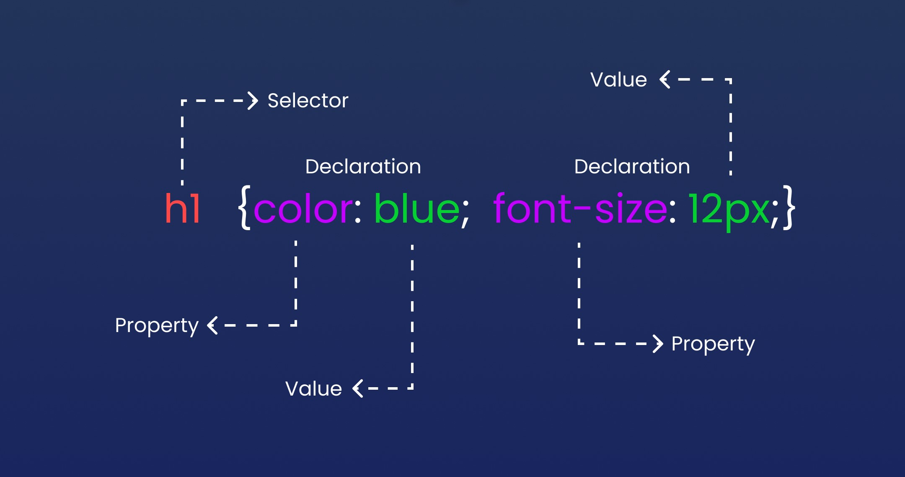

## CSS Syntax

### Apa itu CSS Syntax?

CSS Syntax sendiri mencerminkan tujuan dari penulisan Syntax CSS yang baku, terdiri dari `selector` dan `declaration`.



Terdapat 2 unsur penting yaitu `selector` dan `declaration`, berikut penjelasannya:

- Selector: Selector sendiri digunakan untuk mendeklarasikan atribut HTML yang ingin diberi gaya CSS ke dalamnya.
- Declaration: Declaration digunakan untuk mendeklarasikan properti dan nilai di dalam sebuah blok elemen yang biasanya dipisahkan oleh `semicolon` atau `titik koma`.

Contoh lain :

```css
p {
  color: blue;
  text-align: right;
}
```

### Penjelasan:

- Tag `p` di atas sendiri berperan sebagai selector.
- Lalu `color` dan `text-align` berperan sebagai properti.
- Sedangkan `blue` dan `right` berperan sebagai nilai dari masing-masing properti.

## Referensi

Untuk referensi lengkapnya, Anda dapat mengunjungi situs web berikut:

- [MDN Web Docs](https://developer.mozilla.org/en-US/docs/Web/CSS/Syntax)
- [W3Schools](https://www.w3schools.com/css/css_syntax.asp)
